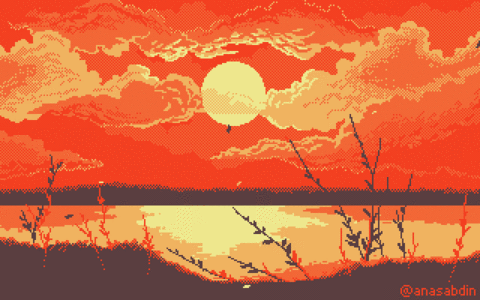

  

<h2 align=center>» I'm a Full-Stack Developer and Illustrator/Graphic Designer «</h2> 

⌜ 🔭 Today I develop more front-end,  
⌜ 🎨 I'm creating a mangá,  
⌜ 🌱 Lately studying TypeScript and Nest,  
⌜ 📫 Contact me at email: gvlima.contato@gmail.com 

 

#

<h3 align=center>»「 My skills 」«</h3>

 
  

  

<h3 align=center> »「 Socials 」«</h3> 

 
  
  
   
  
   

#

  <h3>»「 GitHub Stats 」«</h3> 
  
   
 

#

<picture align="center">
  <source media="(prefers-color-scheme: dark)" srcset="https://raw.githubusercontent.com/inkmors/inkmors/output/github-contribution-grid-snake-dark.svg">
  <source media="(prefers-color-scheme: light)" srcset="https://raw.githubusercontent.com/inkmors/inkmors/output/github-contribution-grid-snake-dark.svg">
  
</picture>
